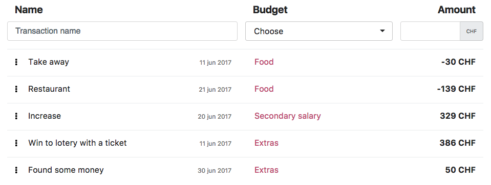
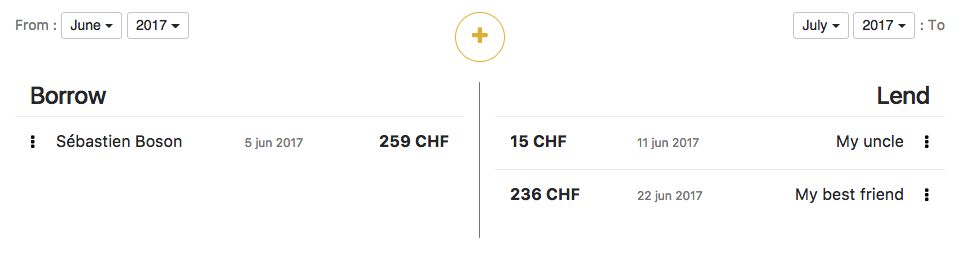
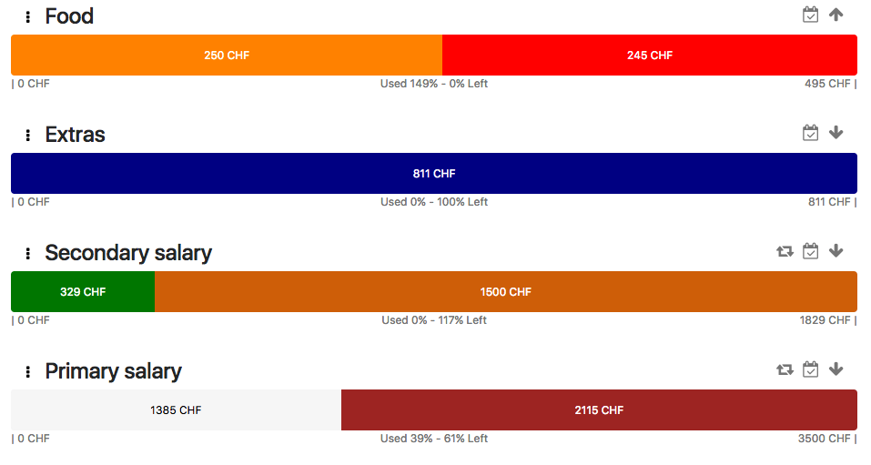
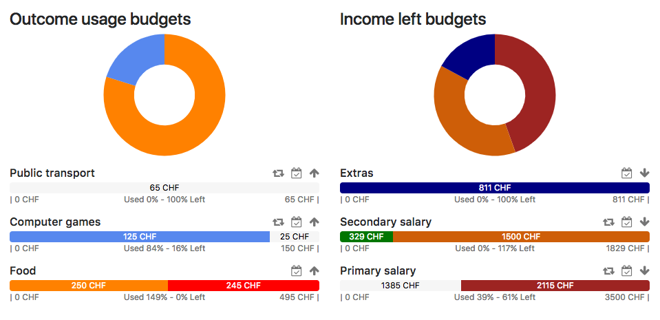

# PiggyBank

## Context

**PiggyBank** is a web application that was made for the Scala course at HEIG-VD.

It's a project made in the end of a semester that has permitted us to consolidate our knowledge in the programming language **Scala**.

This project was limited to a 3 week schedule.

## Description

**PiggyBank** allows you to manage your spendings and incomes in a specific currency.
You just have to create an account with your preferred currency to start using it.

**PiggyBank** offers three major features:
  
  1. You can add borrows and lends to your account to remember how much money you owe to other people and how much money the others ows you.
  
  2. You can create specific budgets for your needs. A budget is mainly defined by a type that can be an income or an outcome, a persistent duration which represent the time before the budget will be reinitialized, and finally, the amount of the budget.
     
     In addition, you can of course define the name of the budget, a reported value that indicates if you want that the eventual exceeding value to be reported when the budget is reinitialized, and a color to put nice background color for the budget representation. For the the budgets of type outcome, you can specify the budgets from which the money will be levied.
     
     For example, you can have a budget for your salary of type income with an amount of 5000 and a budget for your food spendings of type outcome with an amount of 400 that takes money from your salary budget.
  
  3. To make use of the budgets, you can create transactions that are linked to a specific budget and will automatically update the budget according to the amount of the transaction. Transactions with positive amounts will be associated to income budgets and transactions with negative amounts will be associated to outcome budgets.
     
     For example, if you define a transaction linked to your salary budget with an amount of 50. The application will automatically update the budget by adding the specified amount to the budget. In this case, because the budget is of type income, the amount will be added to the budget and a positive exceeding will be calculated (because, you don't have already defined a spending for the outcome budget that takes money from this salary budget). Inversely if you exceed an outcome budget, a negative exceeding will be calculated.

**PiggyBank** has also a nice dashboard that will present you statistics about your spendings and incomes with colored graphics.

---
---

---
---

---
---

---
---

---
---

## Technologies used

**PiggyBank** was made with the following technologies:

  1. [Scala Play Framework](https://playframework.com/)
  
  2. [Slick](http://slick.lightbend.com/)
  
  3. [SQLite](https://www.sqlite.org/)
  
  4. [Scala.js](http://www.scala-js.org/)
  
  5. [Bootstrap](http://getbootstrap.com/)

Don't hesitate to read the file **api.yaml** in the root of the project to understand how the REST API works if you want to use it.
Feel also free to use the Postman requests that you will find in the [wiki](https://github.com/MathieuUrstein/HEIG.SCALA.Projet/wiki)!

Be aware to change the parameter **play.crypto.secret** in the file **application.conf** with a better secret key before using this application.
Because it is this value that is used to sign the JWT token used to protect the REST API.

## Deployment

To deploy the application, you'll only need the following requirement:
- SBT 0.13.15 (last version at the end of the project)

After installing the requirement, go to the root of the project (after a clone of this repo) and first check that you have a folder named **db** with
a file named **piggyBank.db** inside it. It is a SQLite database that contains some examples data. If it is not the case, just create an empty folder named **db**. Then you can launch the application with SBT. You just have to apply a script to create the database (evolution) by pressing a button in your browser. After that, a clean database will be created inside the **db** folder and you can start using the web application.

To launch the application with SBT, go to the root of the project and execute the following commands:

```sbt```

```clean``` (in SBT)

```run``` (in SBT)

or 

```sbt clean``` (out of SBT)
```sbt run``` (out of SBT)

Normally your default browser will be opened at the following address **http://localhost:9000/**. If it is not the case, open it manually.

## Users already created with examples data

Here you can find a table with the actual users in the database.

```
id        fullname                    email                                password            currency
1         Sébastien Boson             sebastien.boson@test.ch              boson               CHF
2         Mathieu Urstein             mathieu.urstein@test.ch              urstein             CHF
3         Jean Durand                 jean.durand@test.ch                  durand              CHF
4         Paul Bonvin                 paul.bonvin@test.ch                  bonvin              CHF
```

## Problems encountered

We have encountered several problems during the development of this application. Here you can find some of them.

The major problem that we can consider is the lack of documentation (12 june 2017). Because all technologies related to Scala (Scala.js, Scala Play and Slick) are really new, you can't find really good documentation. You have to test several possibilities before to find a solution to a problem or to search on websites like **https://stackoverflow.com/** if someone had the same problem and a solution that opefully works.

That introduces an other problem. It is the lack of time. We don't have enough time to test all the edge cases for a project like this. We have to find additionnal time although the end of the semester is already overloaded. 

Starting a project with such en environement is quite hard. You have to manage lots of modules and build configurations.

No up to date Charjs Facades for Scalajs. We had to do our own.

## Improvements

At the moment, the application is functionnal. You can use the features presented in the **description** section with just some restrictions.

It is not possible to PATCH the type and the takesFrom budgets for a particular budget. When a budget is deleted, the eventual budgets that depend on it are not updated (takesFrom values). It would be possible to do that with some checks and modifications on the server side. When a transaction is updated with a change in the amount or the budgetId fields, the linked budgets are not updated. The same when we delete a transaction. These two last things would be also possible with some changes on the server side.

Also, edge cases have not been tested and will probably fail.

Now we can give a list of possible improvements on the server side:

  * Restrict the type of a budget to values "income" and "outcome".
  * Check that the left and used values for a budget are not negative.
  * Check that the order of the takesFrom values (budgets) is correct (no negative value).
  * Restrict the type of an exchange to values "borrow" and "lend".
  * Add treatment when the user is already connected and try to connect himslef again (error message).
  * Invaliding JWT (both for logout and the change of the user's email).
  * Make better error messages when a budget is created.
  * Add a debt management when all incomes are exhausted.
  * Remove the error that appears when the server receives a number that begins with the value "0" in JSON.

## Authors

Made by, 
[Sébastien Boson](https://github.com/sebastie-boson)
[Mathieu Urstein](https://github.com/MathieuUrstein)
